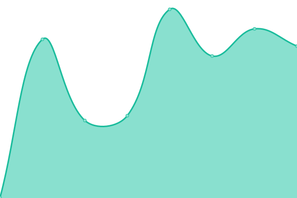

# [📈 Live Status](https://lukebsa.github.io/status): <!--live status--> **🟩 All systems operational**

This repository contains the open-source uptime monitor and status page for [Luke Schweickart](https://lukeschweickart.com), powered by [Upptime](https://github.com/upptime/upptime).

With [Upptime](https://upptime.js.org), you can get your own unlimited and free uptime monitor and status page, powered entirely by a GitHub repository. We use [Issues](https://github.com/lukebsa/status/issues) as incident reports, [Actions](https://github.com/lukebsa/status/actions) as uptime monitors, and [Pages](https://lukebsa.github.io/status) for the status page.

<!--start: status pages-->
<!-- This summary is generated by Upptime (https://github.com/upptime/upptime) -->
<!-- Do not edit this manually, your changes will be overwritten -->
<!-- prettier-ignore -->
| URL | Status | History | Response Time | Uptime |
| --- | ------ | ------- | ------------- | ------ |
|  [lukeschweickart.com](https://lukeschweickart.com) | 🟩 Up | [lukeschweickart-com.yml](https://github.com/lukebsa/status/commits/HEAD/history/lukeschweickart-com.yml) | 

 2775ms
     
 | 

<a href="https://lukebsa.github.io/status/history/lukeschweickart-com">99.54%</a>
    

|  [schweickart.me](https://schweickart.me) | 🟩 Up | [schweickart-me.yml](https://github.com/lukebsa/status/commits/HEAD/history/schweickart-me.yml) | 

 4931ms
     
 | 

<a href="https://lukebsa.github.io/status/history/schweickart-me">99.75%</a>
    

|  [blog.lukeschweickart.com](https://blog.lukeschweickart.com) | 🟩 Up | [blog-lukeschweickart-com.yml](https://github.com/lukebsa/status/commits/HEAD/history/blog-lukeschweickart-com.yml) | 

 326ms
     
 | 

<a href="https://lukebsa.github.io/status/history/blog-lukeschweickart-com">100.00%</a>
    

|  [oweb-lukeschweickart](https://oweb3.lukeschweickart.com) | 🟩 Up | [oweb-lukeschweickart.yml](https://github.com/lukebsa/status/commits/HEAD/history/oweb-lukeschweickart.yml) | 

 203ms
     
 | 

<a href="https://lukebsa.github.io/status/history/oweb-lukeschweickart">100.00%</a>
    

|  [kiondaga.org](https://kiondaga.org) | 🟩 Up | [kiondaga-org.yml](https://github.com/lukebsa/status/commits/HEAD/history/kiondaga-org.yml) | 

 360ms
     
 | 

<a href="https://lukebsa.github.io/status/history/kiondaga-org">99.59%</a>
    

|  [stage.kiondaga.org](https://stage.kiondaga.org) | 🟩 Up | [stage-kiondaga-org.yml](https://github.com/lukebsa/status/commits/HEAD/history/stage-kiondaga-org.yml) | 

 434ms
     
 | 

<a href="https://lukebsa.github.io/status/history/stage-kiondaga-org">100.00%</a>
    

|  [tradingpost.kiondaga.org](https://tradingpost.kiondaga.org) | 🟩 Up | [tradingpost-kiondaga-org.yml](https://github.com/lukebsa/status/commits/HEAD/history/tradingpost-kiondaga-org.yml) | 

 393ms
     
 | 

<a href="https://lukebsa.github.io/status/history/tradingpost-kiondaga-org">99.67%</a>
    

|  [social.kiondaga.org](https://social.kiondaga.org) | 🟩 Up | [social-kiondaga-org.yml](https://github.com/lukebsa/status/commits/HEAD/history/social-kiondaga-org.yml) | 

 146ms
     
 | 

<a href="https://lukebsa.github.io/status/history/social-kiondaga-org">100.00%</a>
    

|  [kionda.ga](https://kionda.ga) | 🟩 Up | [kionda-ga.yml](https://github.com/lukebsa/status/commits/HEAD/history/kionda-ga.yml) | 

 4228ms
     
 | 

<a href="https://lukebsa.github.io/status/history/kionda-ga">99.68%</a>
    

<!--end: status pages-->

[**Visit our status website →**](https://lukebsa.github.io/status)

## 📄 License

- Powered by: [Upptime](https://github.com/upptime/upptime)
- Code: [MIT](./LICENSE) © [Luke Schweickart](https://lukeschweickart.com)
- Data in the `./history` directory: [Open Database License](https://opendatacommons.org/licenses/odbl/1-0/)
