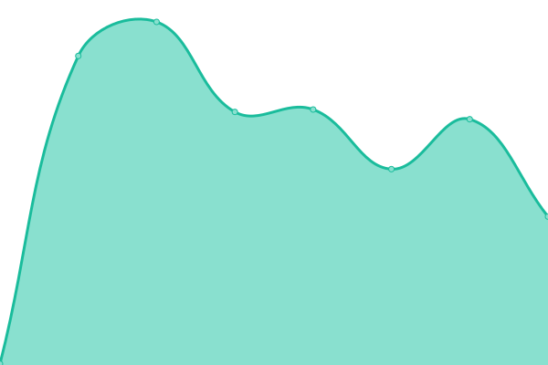
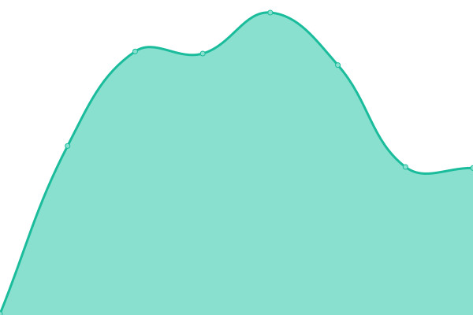
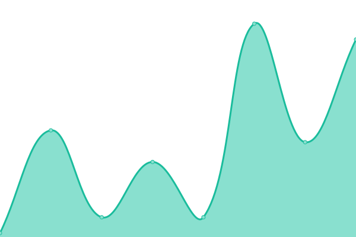
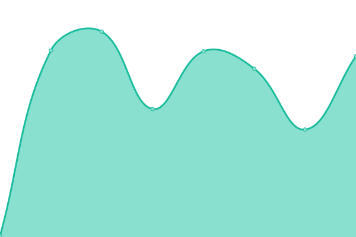
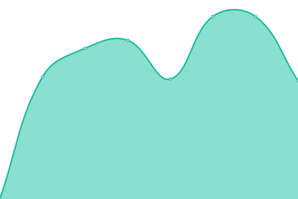
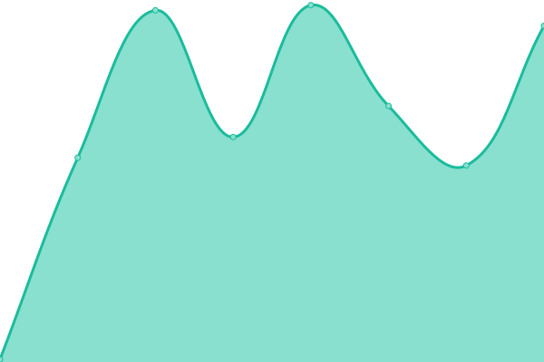
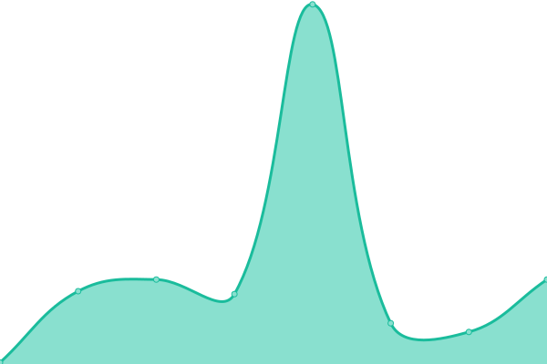

# [📈 Live Status](https://status.lukeschweickart.com): <!--live status--> **🟩 All systems operational**

This repository contains the open-source uptime monitor and status page for [Luke Schweickart](https://lukeschweickart.com), powered by [Upptime](https://github.com/upptime/upptime).

With [Upptime](https://upptime.js.org), you can get your own unlimited and free uptime monitor and status page, powered entirely by a GitHub repository. We use [Issues](https://github.com/lukebsa/status/issues) as incident reports, [Actions](https://github.com/lukebsa/status/actions) as uptime monitors, and [Pages](https://status.lukeschweickart.com) for the status page.

<!--start: status pages-->
<!-- This summary is generated by Upptime (https://github.com/upptime/upptime) -->
<!-- Do not edit this manually, your changes will be overwritten -->
<!-- prettier-ignore -->
| URL | Status | History | Response Time | Uptime |
| --- | ------ | ------- | ------------- | ------ |
|  [lukeschweickart.com](https://lukeschweickart.com) | 🟩 Up | [lukeschweickart-com.yml](https://github.com/lukebsa/status/commits/HEAD/history/lukeschweickart-com.yml) | 

 261ms
     
 | 

<a href="https://status.lukeschweickart.com/history/lukeschweickart-com">100.00%</a>
    

|  [schweickart.me](https://schweickart.me) | 🟩 Up | [schweickart-me.yml](https://github.com/lukebsa/status/commits/HEAD/history/schweickart-me.yml) | 

 228ms
     
 | 

<a href="https://status.lukeschweickart.com/history/schweickart-me">100.00%</a>
    

|  [blog.lukeschweickart.com](https://blog.lukeschweickart.com) | 🟩 Up | [blog-lukeschweickart-com.yml](https://github.com/lukebsa/status/commits/HEAD/history/blog-lukeschweickart-com.yml) | 

 252ms
     
 | 

<a href="https://status.lukeschweickart.com/history/blog-lukeschweickart-com">100.00%</a>
    

|  [oweb-lukeschweickart](https://oweb3.lukeschweickart.com) | 🟩 Up | [oweb-lukeschweickart.yml](https://github.com/lukebsa/status/commits/HEAD/history/oweb-lukeschweickart.yml) | 

 197ms
     
 | 

<a href="https://status.lukeschweickart.com/history/oweb-lukeschweickart">100.00%</a>
    

|  [oweb-lukeschweickart-ipv6](https://oweb3.lukeschweickart.com) | 🟩 Up | [oweb-lukeschweickart-ipv6.yml](https://github.com/lukebsa/status/commits/HEAD/history/oweb-lukeschweickart-ipv6.yml) | 

 29ms
     
 | 

<a href="https://status.lukeschweickart.com/history/oweb-lukeschweickart-ipv6">100.00%</a>
    

|  [kiondaga.org](https://kiondaga.org) | 🟩 Up | [kiondaga-org.yml](https://github.com/lukebsa/status/commits/HEAD/history/kiondaga-org.yml) | 

 282ms
     
 | 

<a href="https://status.lukeschweickart.com/history/kiondaga-org">100.00%</a>
    

|  [tradingpost.kiondaga.org](https://prod-tradingpost.kiondaga.org/.well-known/ping.html) | 🟩 Up | [tradingpost-kiondaga-org.yml](https://github.com/lukebsa/status/commits/HEAD/history/tradingpost-kiondaga-org.yml) | 

 284ms
     
 | 

<a href="https://status.lukeschweickart.com/history/tradingpost-kiondaga-org">100.00%</a>
    

|  [social.kiondaga.org](https://social.kiondaga.org) | 🟩 Up | [social-kiondaga-org.yml](https://github.com/lukebsa/status/commits/HEAD/history/social-kiondaga-org.yml) | 

 205ms
     
 | 

<a href="https://status.lukeschweickart.com/history/social-kiondaga-org">100.00%</a>
    

|  [kionda.ga](https://kionda.ga) | 🟩 Up | [kionda-ga.yml](https://github.com/lukebsa/status/commits/HEAD/history/kionda-ga.yml) | 

 350ms
     
 | 

<a href="https://status.lukeschweickart.com/history/kionda-ga">100.00%</a>
    

|  [Kiondaga Portal (Google Sites)](https://sites.google.com/kiondaga.org/portal/ping) | 🟩 Up | [kiondaga-portal-google-sites.yml](https://github.com/lukebsa/status/commits/HEAD/history/kiondaga-portal-google-sites.yml) | 

 290ms
     
 | 

<a href="https://status.lukeschweickart.com/history/kiondaga-portal-google-sites">100.00%</a>
    

|  [portal.kiondaga.org](https://portal.kiondaga.org/ping) | 🟩 Up | [portal-kiondaga-org.yml](https://github.com/lukebsa/status/commits/HEAD/history/portal-kiondaga-org.yml) | 

 294ms
     
 | 

<a href="https://status.lukeschweickart.com/history/portal-kiondaga-org">100.00%</a>
    

|  [linktree/kiondaga](https://linktr.ee/kiondaga) | 🟩 Up | [linktree-kiondaga.yml](https://github.com/lukebsa/status/commits/HEAD/history/linktree-kiondaga.yml) | 

 360ms
     
 | 

<a href="https://status.lukeschweickart.com/history/linktree-kiondaga">100.00%</a>
    

|  [linktree/kiondagalodge](https://linktr.ee/kiondagalodge) | 🟩 Up | [linktree-kiondagalodge.yml](https://github.com/lukebsa/status/commits/HEAD/history/linktree-kiondagalodge.yml) | 

 88ms
     
 | 

<a href="https://status.lukeschweickart.com/history/linktree-kiondagalodge">98.69%</a>
    

<!--end: status pages-->

[**Visit our status website →**](https://status.lukeschweickart.com)

## 📄 License

- Powered by: [Upptime](https://github.com/upptime/upptime)
- Code: [MIT](./LICENSE) © [Anand Chowdhary](https://anandchowdhary.com), supported by [Pabio](https://pabio.com)
- Data in the `./history` directory: [Open Database License](https://opendatacommons.org/licenses/odbl/1-0/)
